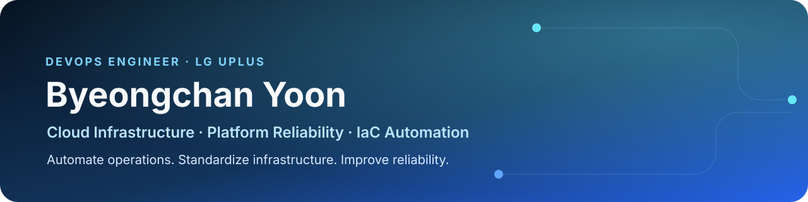

## Engineering focus

클라우드 인프라를 안정적으로 운영하고, 반복 작업을 자동화·표준화한다.

- **Infrastructure automation** — Ansible 기반 DB provisioning 시스템 구축
- **Platform modernization** — EC2 워크로드의 EKS 전환
- **Operational reliability** — EKS 스케줄링과 EC2 capacity 이슈 대응, 무중단 운영

`AWS` · `Kubernetes` · `Terraform` · `Ansible` · `GitOps`

## Featured talk

**AWS Summit Seoul 2026 · Community Track**

[Kiro와 Terraform convention으로 IaC 업무를 표준화한 경험](https://www.linkedin.com/posts/byeongchan-yoon-7022aa136_awssummitseoul2026-kiro-iac-activity-7464453935697657856-CuvD)

## Selected engineering notes

- **Platform & FinOps** — [AWS EKS에서 팀별 비용을 분리하는 기준](https://chaaany.tistory.com/478)
- **Reliability** — [써드파티 API 장애를 전제로 설계하는 방법](https://chaaany.tistory.com/479)
- **Systems** — [실제 메모리 문제를 분석하는 흐름](https://chaaany.tistory.com/496)
- **AI & Automation** — [MCP 서버를 구현하고 Amazon Q Developer에 연결하기](https://chaaany.tistory.com/436)

## Credential

- **CKA: Certified Kubernetes Administrator** · Valid through 2026-10

Professional experience is summarized from LinkedIn. Technical articles are writing and learning records.
